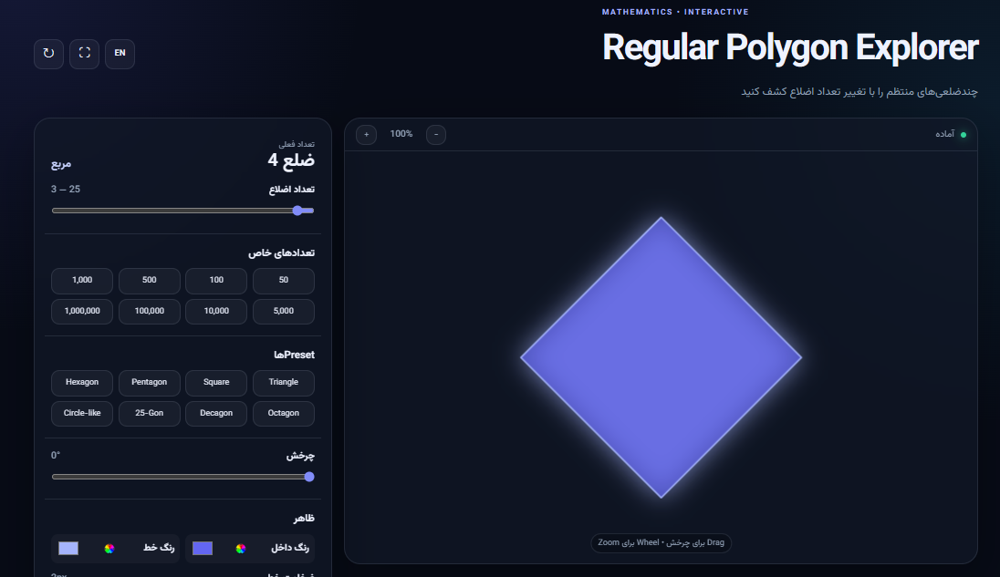
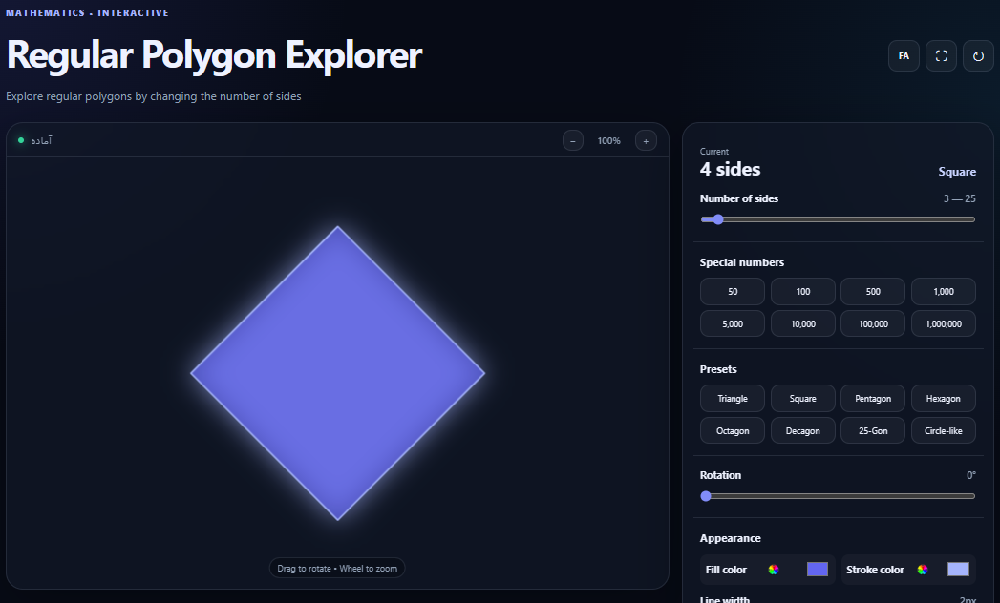

# Regular Polygon Explorer

> یک ابزار تعاملی و حرفه‌ای برای مشاهده، بررسی و مقایسهٔ چندضلعی‌های منتظم.

**🇮🇷 فارسی | 🇬🇧 [English](README.md)**

---

<p align="center">

[🚀 مشاهدهٔ آنلاین پروژه](https://AplayerDev.github.io/regular-polygon-explorer/)
  •  
[🇬🇧 English](README.md)

</p>

## 🖼️ تصاویر پروژه

### رابط کاربری فارسی

<p align="center">
  
</p>

تصویر بالا نمایی از رابط کاربری فارسی پروژه را نشان می‌دهد که شامل Canvas تعاملی، کنترل‌های چندضلعی، اطلاعات ریاضی و تنظیمات ظاهری است.

---

### رابط کاربری انگلیسی

<p align="center">
  
</p>

پروژه علاوه بر رابط فارسی، از رابط انگلیسی با چیدمان LTR نیز پشتیبانی می‌کند.

---

## معرفی

**Regular Polygon Explorer** یک برنامهٔ تحت وب تعاملی برای نمایش، بررسی و مقایسهٔ چندضلعی‌های منتظم است.

کاربر می‌تواند تعداد اضلاع را تغییر دهد، شکل را بچرخاند و بزرگ‌نمایی کند، ظاهر آن را شخصی‌سازی کند، اطلاعات ریاضی مربوط به چندضلعی را مشاهده کند، آن را با دایره مقایسه کند و خروجی PNG یا SVG بگیرد.

این پروژه کاملاً با **HTML5، CSS3 و Vanilla JavaScript** ساخته شده و برای اجرا به Backend، Framework یا کتابخانهٔ خارجی نیاز ندارد.

---

## ✨ امکانات

* رسم دقیق چندضلعی‌های منتظم با HTML Canvas
* پشتیبانی از **۳ تا ۱,۰۰۰,۰۰۰ ضلع**
* Slider تعاملی برای انتخاب تعداد اضلاع
* تعدادهای خاص:

  * ۵۰
  * ۱۰۰
  * ۵۰۰
  * ۱,۰۰۰
  * ۵,۰۰۰
  * ۱۰,۰۰۰
  * ۱۰۰,۰۰۰
  * ۱,۰۰۰,۰۰۰
* Presetهای رایج چندضلعی‌ها
* مثلث
* مربع
* پنج‌ضلعی
* شش‌ضلعی
* هشت‌ضلعی
* ده‌ضلعی
* ۲۵ ضلعی
* حالت شبیه دایره
* انیمیشن Morph هنگام تغییر شکل
* Rotation با Slider
* چرخش با Drag روی Canvas
* Zoom
* Zoom با Mouse Wheel
* Zoom با Keyboard
* نمایش رأس‌ها
* نمایش دایرهٔ محیطی
* حالت مقایسه با دایره
* انتخاب رنگ داخل چندضلعی
* انتخاب رنگ خط
* تنظیم ضخامت خط
* خروجی PNG
* خروجی SVG
* حالت Fullscreen
* Reset کامل
* ذخیرهٔ تنظیمات با `localStorage`
* رابط کاربری فارسی و انگلیسی
* پشتیبانی از RTL و LTR
* فونت فارسی داخلی
* طراحی Responsive
* قابلیت‌های Accessibility
* Rendering بهینه برای چندضلعی‌های بسیار بزرگ
* بدون Backend
* بدون وابستگی خارجی

---

## 🌐 پشتیبانی از زبان

برنامه از دو زبان پشتیبانی می‌کند:

* 🇮🇷 فارسی
* 🇬🇧 English

کاربر می‌تواند زبان رابط کاربری را مستقیماً از داخل برنامه تغییر دهد.

با تغییر زبان، موارد زیر نیز تغییر می‌کنند:

* عنوان‌ها
* متن دکمه‌ها
* توضیحات
* اطلاعات ریاضی
* نام چندضلعی‌ها
* متن Keyboard Shortcuts
* جهت نمایش رابط کاربری

در حالت فارسی، رابط کاربری به صورت **RTL** و در حالت انگلیسی به صورت **LTR** نمایش داده می‌شود.

زبان انتخاب‌شده نیز با استفاده از `localStorage` ذخیره می‌شود.

---

## 🔤 فونت فارسی

پروژه از فونت فارسی داخلی استفاده می‌کند تا نمایش متن فارسی به سرویس‌های خارجی وابسته نباشد.

ساختار فونت‌ها:

```text
fonts/
├── Vazirmatn-Regular.woff2
├── Vazirmatn-Medium.woff2
├── Vazirmatn-SemiBold.woff2
└── Vazirmatn-Bold.woff2
```

به این ترتیب، حتی در شرایطی که دسترسی به سرویس‌های خارجی وجود نداشته باشد، رابط فارسی برنامه می‌تواند به درستی نمایش داده شود.

---

## 📐 مبانی ریاضی

برای یک چندضلعی منتظم با `n` ضلع:

### زاویهٔ مرکزی

```text
360° / n
```

### زاویهٔ داخلی

```text
((n − 2) × 180°) / n
```

### نسبت مساحت چندضلعی به مساحت دایرهٔ محیطی

```text
n × sin(2π/n) / (2π)
```

با افزایش تعداد اضلاع، زاویهٔ مرکزی کوچک‌تر می‌شود و مرز چندضلعی بیشتر به محیط دایره نزدیک می‌شود.

در حالت حدی:

```text
n → ∞
```

یک چندضلعی منتظم به دایره نزدیک می‌شود.

---

## ⚡ بهینه‌سازی عملکرد

برنامه برای کار با تعداد بسیار زیاد اضلاع بهینه شده است.

برای مثال، کاربر می‌تواند:

```text
۱,۰۰۰,۰۰۰ ضلع
```

را انتخاب کند.

مقدار واقعی `n` برای محاسبات ریاضی و نمایش اطلاعات حفظ می‌شود.

اما رسم یک میلیون Segment مجزا روی Canvas از نظر بصری ضروری نیست. بنابراین در تعدادهای بسیار بزرگ، Renderer تعداد Segmentهای قابل مشاهده را به یک مقدار منطقی محدود می‌کند.

این روش باعث می‌شود:

* مصرف CPU کاهش پیدا کند.
* عملیات Canvas کاهش پیدا کند.
* انیمیشن روان‌تر باشد.
* مصرف حافظه کاهش پیدا کند.
* ظاهر چندضلعی حفظ شود.

این بهینه‌سازی مقدار ریاضی واقعی چندضلعی را تغییر نمی‌دهد.

---

## 🎮 نحوهٔ استفاده

### تعداد اضلاع

Slider اصلی امکان انتخاب چندضلعی بین:

```text
۳ — ۲۵ ضلع
```

را فراهم می‌کند.

برای تعدادهای بزرگ‌تر می‌توان از دکمه‌های **تعدادهای خاص** استفاده کرد.

### Rotation

چندضلعی را می‌توان با:

* Slider چرخش
* Drag روی Canvas

چرخاند.

### Zoom

بزرگ‌نمایی از طریق:

* دکمه `+`
* دکمه `−`
* Mouse Wheel
* Keyboard

امکان‌پذیر است.

### ظاهر

موارد زیر قابل شخصی‌سازی هستند:

* رنگ داخل
* رنگ خط
* ضخامت خط

### نمایش

کاربر می‌تواند موارد زیر را فعال یا غیرفعال کند:

* نمایش رأس‌ها
* نمایش دایرهٔ محیطی
* مقایسه با دایره

---

## ⌨️ میانبرهای صفحه‌کلید

| کلید          | عملکرد             |
| ------------- | ------------------ |
| `Arrow Up`    | افزایش تعداد اضلاع |
| `Arrow Right` | افزایش تعداد اضلاع |
| `Arrow Down`  | کاهش تعداد اضلاع   |
| `Arrow Left`  | کاهش تعداد اضلاع   |
| `R`           | بازنشانی           |
| `F`           | تمام‌صفحه          |
| `+`           | بزرگ‌نمایی         |
| `-`           | کوچک‌نمایی         |

هنگام تایپ در `input`، `textarea` یا `select`، میانبرهای صفحه‌کلید غیرفعال هستند.

---

## 💾 ذخیرهٔ تنظیمات

تنظیمات کاربر با استفاده از `localStorage` مرورگر ذخیره می‌شوند.

مواردی مانند موارد زیر می‌توانند ذخیره شوند:

* تعداد اضلاع
* Rotation
* Zoom
* رنگ داخل
* رنگ خط
* ضخامت خط
* نمایش رأس‌ها
* نمایش دایرهٔ محیطی
* حالت مقایسه با دایره
* زبان انتخاب‌شده

بنابراین پس از Reload شدن صفحه، تنظیمات قبلی کاربر قابل بازیابی هستند.

---

## 📤 خروجی گرفتن

### PNG

کاربر می‌تواند شکل فعلی را به صورت تصویر PNG دریافت کند.

نمونه نام فایل:

```text
regular-polygon-4.png
```

### SVG

امکان خروجی گرفتن به صورت SVG نیز وجود دارد.

نمونه نام فایل:

```text
regular-polygon-4.svg
```

SVG برای ویرایش بیشتر در نرم‌افزارهای گرافیکی مناسب است.

---

## 📱 طراحی Responsive

رابط کاربری برای دستگاه‌های مختلف طراحی شده است:

* Desktop
* Laptop
* Tablet
* Mobile

در نمایشگرهای کوچک، کنترل‌ها به صورت مناسب برای موبایل تغییر می‌کنند.

Canvas نیز هنگام تغییر اندازهٔ فضای نمایش، به صورت خودکار Resize می‌شود.

---

## ♿ دسترسی‌پذیری

در طراحی پروژه اصول Accessibility نیز در نظر گرفته شده است.

برخی قابلیت‌ها:

* HTML معنایی
* ARIA Labels
* Keyboard Navigation
* Focus قابل مشاهده
* عناصر Dynamic Output
* دکمه‌ها و کنترل‌های قابل دسترسی
* پشتیبانی از RTL / LTR
* رابط Responsive

---

## 🛠️ تکنولوژی‌ها

پروژه با تکنولوژی‌های زیر ساخته شده است:

* **HTML5**
* **CSS3**
* **Vanilla JavaScript**
* **Canvas API**
* **Web Storage API**
* **Fullscreen API**
* **Pointer Events API**

### بدون نیاز به Framework یا کتابخانهٔ خارجی

پروژه از موارد زیر استفاده نمی‌کند:

* React
* Vue
* Angular
* jQuery
* Bootstrap
* Tailwind CSS
* Three.js
* Backend
* کتابخانه‌های JavaScript خارجی

---

## 📁 ساختار پروژه

```text
regular-polygon-explorer/
│
├── index.html
├── style.css
├── script.js
├── README.md
├── README.fa.md
├── LICENSE
│
├── fonts/
│   ├── Vazirmatn-Regular.woff2
│   ├── Vazirmatn-Medium.woff2
│   ├── Vazirmatn-SemiBold.woff2
│   └── Vazirmatn-Bold.woff2
│
└── assets/
    ├── screenshot-en.png
    └── screenshot-fa.png
```

---

## 🚀 اجرای پروژه

برای اجرای پروژه نیازی به نصب Package یا Build کردن پروژه نیست.

کافی است فایل:

```text
index.html
```

را با یک مرورگر مدرن باز کنید.

پروژه همچنین می‌تواند روی هر Static Web Server اجرا شود.

---

## 🌍 انتشار در GitHub Pages

این پروژه با GitHub Pages کاملاً سازگار است.

برای انتشار:

1. یک Repository در GitHub ایجاد کنید.
2. فایل‌های پروژه را Upload کنید.
3. وارد **Settings** شوید.
4. بخش **Pages** را باز کنید.
5. در قسمت **Build and deployment** گزینهٔ زیر را انتخاب کنید:

```text
Deploy from a branch
```

6. Branch اصلی، معمولاً `main`، را انتخاب کنید.
7. پوشه را روی:

```text
/ (root)
```

قرار دهید.
8. روی **Save** کلیک کنید.

پس از Deploy شدن، پروژه به صورت یک وب‌سایت استاتیک روی GitHub Pages قابل مشاهده خواهد بود.

---

## 🧪 مرورگرهای پیشنهادی

پروژه برای مرورگرهای مدرن طراحی شده است، از جمله:

* Google Chrome
* Microsoft Edge
* Mozilla Firefox
* Safari
* Opera

برای بهترین عملکرد، استفاده از نسخهٔ به‌روز مرورگر توصیه می‌شود.

---

## 📄 مجوز

این پروژه تحت **MIT License** منتشر شده است.

Copyright (c) 2026 **AmirMohammad Abdolvand**

متن کامل مجوز در فایل [`LICENSE`](LICENSE) قرار دارد.

---

## 👨‍💻 سازنده

**AmirMohammad Abdolvand**

این پروژه به عنوان یک ابزار آموزشی و تعاملی برای نمایش و بررسی مفاهیم ریاضی مربوط به چندضلعی‌های منتظم طراحی شده است.

---

## ⭐ حمایت از پروژه

اگر این پروژه برای شما مفید بود، می‌توانید با دادن ⭐ به Repository در GitHub از پروژه حمایت کنید.

---

**🇮🇷 فارسی | 🇬🇧 [English](README.md)**
